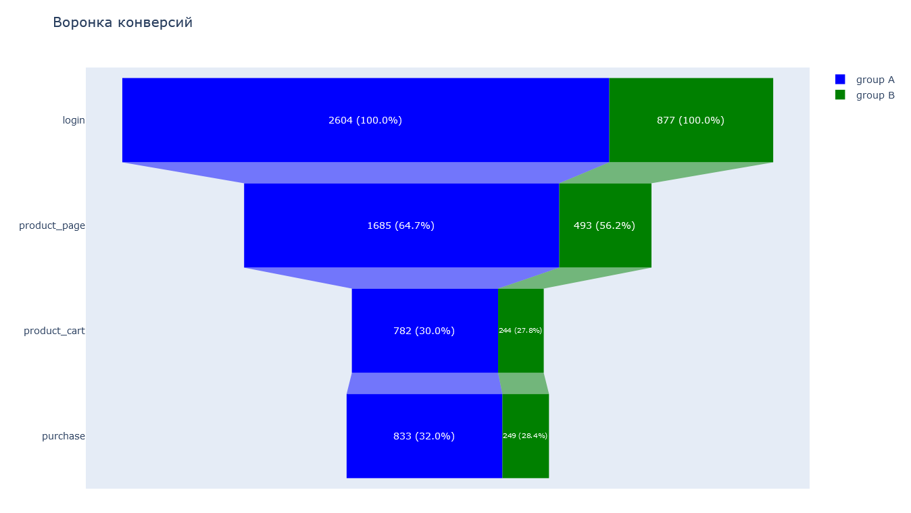

# Анализ результатов A/B теста новой платежной воронки
***
В данном проекте анализируются **результаты A/B тестирования** новой платежной воронки с целью оценки влияния изменений на итоговую **конверсию пользователей** на всех этапах воронки.

**Навыки и инструменты:**
- Python
- Pandas
- Matplotlib
- Scipy
- Seaborn
- Проверка статистических гипотез
- Исследовательский анализ данных

**Описание проекта:**
- Загрузка данных, предобработка для последующего анализа
- Проверка данных на соответствие требованиям
- Исследовательский анализ данных, визуализация
- A/B тестирование. Использование статистических критериев для анализа результатов
- Интерпитация результатов, формулирование выводов

## Результаты
***
После проведения A/B теста, получилась следующая воронка конверсий для двух групп:

По итогу проверки гипотез с односторонней альтернативой о равенстве конверсий на различных этапах воронки, мы не смогли отбросить нулевую гипотезу ни на одном этапе. Это показывает отсутствие статистически значимой разницы конверсий в двух группах, а значит новая модель платежной воронки не является эффективнее старой.
